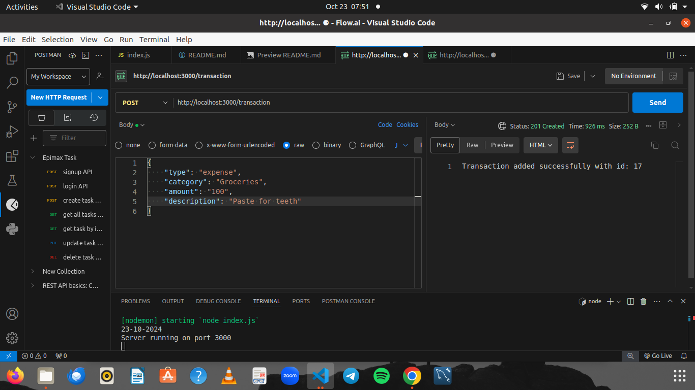
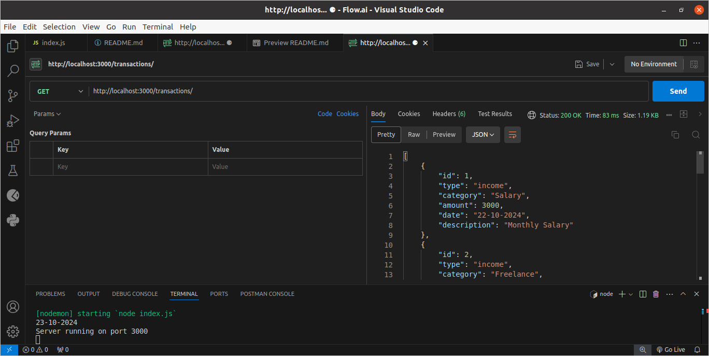
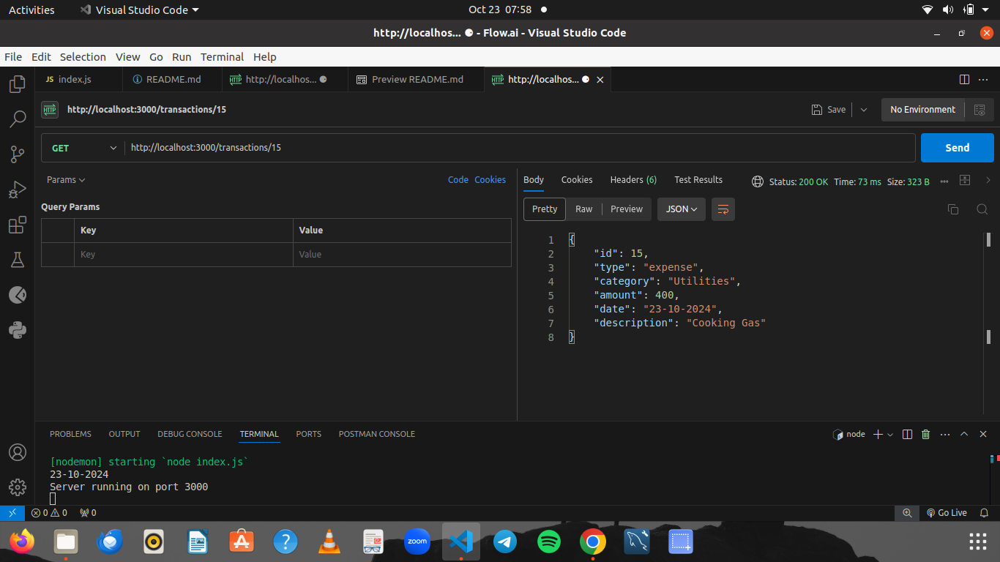
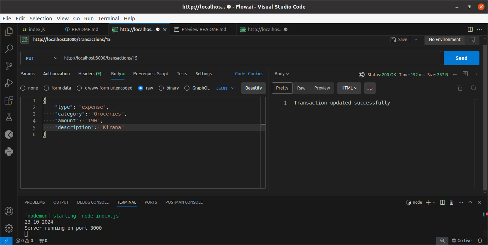
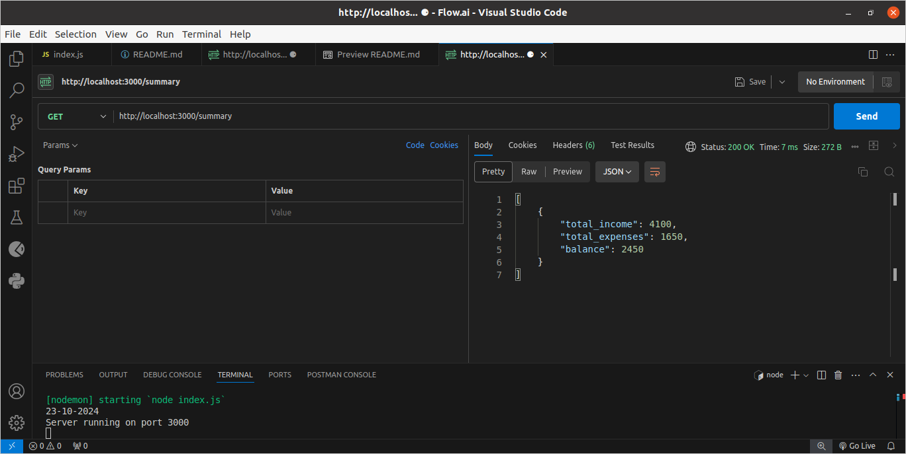
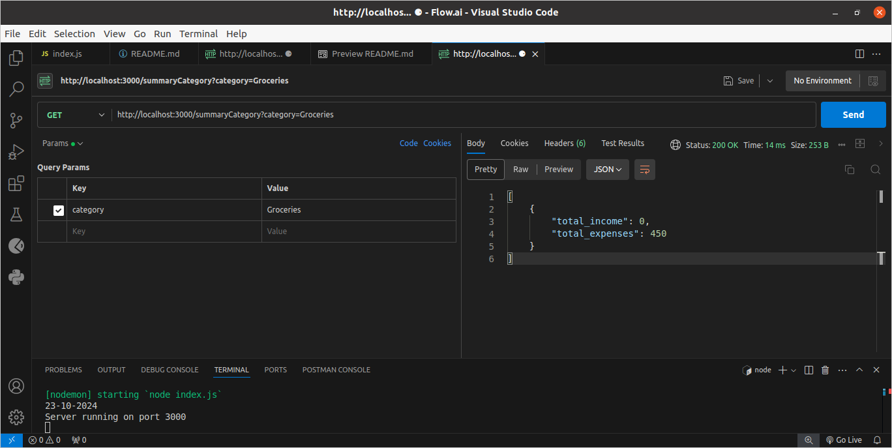
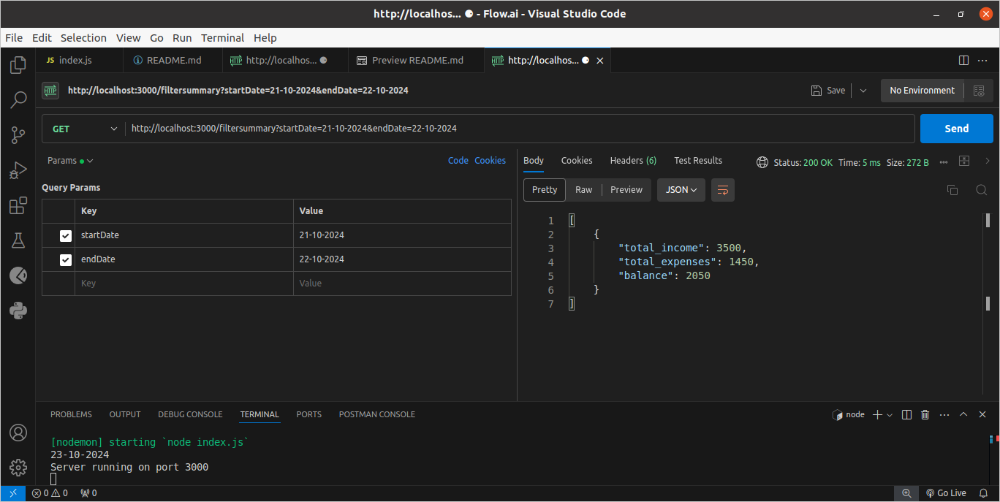

**Personal Expense Tracker API**

This Node.js and Express.js API allows users to manage their personal finances by recording income and expenses, retrieving past transactions, and generating summaries.

**Technologies:**

Backend Framework: Node.js with Express.js

Database: SQLite

**Database Setup (SQLite):**

Create a SQLite database file (finance.db).
Use a database management tool like SQLite Studio or the command line to create the following tables:
SQL

CREATE TABLE transactions (
id INTEGER PRIMARY KEY AUTOINCREMENT,
type TEXT NOT NULL,
category TEXT NOT NULL,
amount REAL NOT NULL,
date DATE NOT NULL,
description TEXT
);

CREATE TABLE categories (
id INTEGER PRIMARY KEY AUTOINCREMENT,
name TEXT NOT NULL,
type TEXT NOT NULL
);

**Installation:**

Install dependencies: npm install express sqlit sqlite3 moment

Start the server: node index.js (Optional: nodemon index.js)

The API will be running on port 3000 by default (you can modify this in index.js).

**API Endpoints**

**1. POST /transaction**

Adds a new transaction (income or expense).
Request Body:
JSON
{
"type": "income" | "expense",
"category": "string",
"amount": number,
"date": "DD-MM-YYYY" (optional, defaults to current date),
"description": "string"
}

**2. GET /transactions**

Retrieves all transactions.

**3. GET /transactions/:id**

Retrieves a transaction by its ID.

**4. PUT /transactions/:id**

Updates a transaction by its ID.
Request Body: Same as POST /transactions (excluding ID).
Response:

**5. DELETE /transactions/:id**

Deletes a transaction by its ID.
Response:

**6. GET /summary**

Retrieves a summary of transactions.
Response:

**7. GET /summarycategory/**

Retrieves a summary based on category
Response:

**8. GET /filtersummary**
Retrieves a summary based on date
Date-format: "DD-MM-YYYY"
Response:

